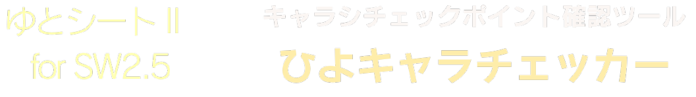

# ゆとシート2 for SW2.5 キャラシチェックポイント確認ツール ひよキャラチェッカー



[ゆとシート2 for SW2.5](https://yutorize.2-d.jp/ytsheet/sw2.5/)で書かれたキャラシについてサッとチェックするツール

# 使い方

1. [ゆとシート2 for SW2.5 キャラシチェックポイント確認ツール ひよキャラチェッカー](https://shunshun94.github.io/shared/other/io/github/shunshun94/trpg/sw2/ytsheet/validation/index.html)にアクセスする
1. キャラクターシートの URL を キャラクターシートURL 欄に入力する
1. 実行を叩く
1. 画面中央の白いエリアに指摘事項一覧が出力される

出力された内容はそのままコピーして Discord で送るとリスト形式で共有される。   
また、重要と思われる指摘ほど上にリストされるように作られている。

# validationList.js の内容

`io.github.shunshun94.trpg.sw2.ytsheet.validation.VALIDATION_LIST` に配列としてチェック項目が可能されている。
その内容は [validationList.html](https://shunshun94.github.io/shared/other/io/github/shunshun94/trpg/sw2/ytsheet/validation/validationList.html) で一覧することができる。

## チェック項目が持つ要素

各チェック項目は以下の値を持つ。

| 項目名 | 内容 |
| ---- | ---- |
| level | エラーの重要度。error, warn, info の3種類の値を取る |
| when | どのような場合に同項目をチェックするか |
| expect | どのような値になることが期待されるか |
| ifNot | when でチェック対象であるとされ、expect で期待された値でなかった場合に表示される指摘文 |
| label | 他のツールがチェック項目を参照するときに利用することを想定した識別用ラベル |

## when および expect が取るべき値

when および expect が持つべき要素は以下の4種類となり、連想配列または文字列の形式で入力する。

### 文字列 "always"

この値の場合は常に合格となる。

### チェックする要素

チェックする要素をキーとし、チェックするべき内容を値として記入する。
複数記入することもでき、その場合は後述の or と同じ挙動を示す。
詳細は後述する。

### and

and の直下にチェックする要素を並べる。
チェックする要素が全て合格した場合に成立する。

### or

or の直下にチェックする要素を並べる。
チェックする要素のいずれかに合格した場合に成立する。

## チェックする要素

キーにゆとシートの要素名称を入れる。
要素の名称と意味については[公式の説明](https://yutorize.2-d.jp/?ytsheet2-json)を参照されたし。
また、キーに正規表現を用いることもできる。

値には true またはそのキーについて合格するか否かを決定する連想配列を与える。

### true

キャラクターシートがそのキーに該当する値を持っている場合に合格する。
以下の例の場合、ソーサラー技能を習得している場合に合格する。

```json
"lvSor": true
```

### ormore

キャラクターシートが持つそのキーに該当する値が数字の場合に用いる。
指定した値以上の場合に合格する。
以下の例の場合、ソーサラー技能のレベルが3以上の場合に合格する。

```json
"lvSor": { "ormore": 3 }
```

### morethan

キャラクターシートが持つそのキーに該当する値が数字の場合に用いる。
指定した値より大きい場合に合格する。
以下の例の場合、ソーサラー技能のレベルが4以上の場合に合格する。

```json
"lvSor": { "morethan": 3 }
```

### orless

キャラクターシートが持つそのキーに該当する値が数字の場合に用いる。
指定した値以下の場合に合格する。
以下の例の場合、ソーサラー技能のレベルが3以下の場合に合格する。

```json
"lvSor": { "orless": 3 }
```

### lessthan

キャラクターシートが持つそのキーに該当する値が数字の場合に用いる。
指定した値未満の場合に合格する。
以下の例の場合、ソーサラー技能のレベルが2以下の場合に合格する。

```json
"lvSor": { "lessthan": 3 }
```

### equal

キャラクターシートが持つそのキーに該当する値が、指定した値と合致する場合に合格する。
値の指定は文字列または文字列の配列で行う。

以下の例の場合、金属鎧または非金属鎧が防具欄に記載されている場合に合格する。
```json
"armour\\d+Category": { "equal": ["金属鎧", "非金属鎧"] }
```

以下の例の場合、金属鎧が防具欄に記載されている場合に合格する。
```json
"armour\\d+Category": { "equal": "金属鎧" }
```

### includes

キャラクターシートが持つそのキーに該当する値が、指定した値を含む場合に合格する。
値の指定は文字列または文字列の配列で行う。

以下の例の場合、いずれかの装飾品の名前欄に軍師徽章の文字列が含まれている場合に合格する。
```json
"accessory.*Name": {"includes": "軍師徽章"}
```

以下の例の場合、いずれかの防具の備考欄に軍師徽章の文字列が含まれている場合に合格する。
```json
"armour\\d+Note":  { "includes": ["盾徽章", "軍師徽章"] }
```

### func

キャラクターシートがそのキーに該当する値を持っている場合に関数を実行し、真の値が返れば合格する。
関数の引数は キー、キーの値、キャラクターのデータ全体 である。

以下の例の場合、ソーサラー技能とコンジャラー技能の双方が2レベル以上ならば合格する。
```javascript
"lvSor": { func: (key, value, json) =>{ return (Number(json.lvSor) >= 2) && (Number(json.lvCon) >= 2);}}
```

## サンプル

[validationList.js](./validationList.js) を参照されたし。

# 関連製品について

本作は、「グループＳＮＥ」及び「株式会社ＫＡＤＯＫＡＷＡ」が権利を有する『ソード・ワールド2.5』のために作られたツールです。   
(C)GroupSNE   
(C)KADOKAWA

# タイトル画像について

[ちびすけさん](https://twitter.com/chibiSMGO)に描いていただきました。ありがとうございます！
